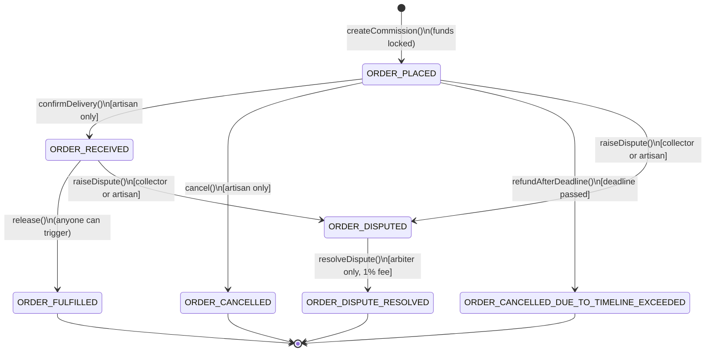

# Commission Escrow

Kalpana paints Warli scenes on cloth in a village three hours from Nashik. A collector in Berlin
wants to commission a piece. Neither wants to trust a middleman with the money: the collector's
payment should be **locked on-chain the moment the deal is struck**, **released to the artisan
only once delivery is confirmed**, **returned automatically to the collector if the deadline
passes with nothing delivered**, and **frozen until a neutral arbiter decides** if the two of them
disagree.

This repo is exactly that, built with [Scaffold-ETH 2](https://scaffoldeth.io) (Foundry + Next.js /
wagmi / viem), targeting Base Sepolia.

```
Collector ──funds──▶  CommissionEscrow  ──releases on delivery──▶  Artisan
                       (one per deal)   ──refunds on timeout────▶  Collector
                                        ──splits on dispute─────▶  winner + 1% to the Arbiter
```

## What's actually in here

- **`CommissionEscrowFactory.sol`** — the entry point. A collector calls `createCommission()`
  here with the agreed price attached as `msg.value`. Internally it deploys a cheap [EIP-1167
  minimal proxy clone](https://eips.ethereum.org/EIPS/eip-1167) of `CommissionEscrow` for that one
  deal (so every commission gets its own contract, without paying full deployment gas each time).
  It also holds the global, OpenZeppelin-`AccessControl`-backed `ARBITER_ROLE` roster, and a public
  list of every commission currently in dispute — the "marketplace" any approved arbiter can pick
  work from.
- **`CommissionEscrow.sol`** — the escrow logic itself, one instance per commission. Handles
  funding, delivery confirmation, payout, timeout refunds, early cancellation, and dispute
  resolution. Uses OpenZeppelin's `ReentrancyGuard` and the Checks-Effects-Interactions pattern
  throughout, so state is always finalized before any ETH leaves the contract.
- **`packages/foundry/test/`** — 34 Foundry tests covering the full lifecycle (see [Running the
  tests](#running-the-tests) below).
- **`packages/nextjs/`** — the stock Scaffold-ETH 2 frontend. No custom pages were built for this
  challenge; the built-in **Debug Contracts** page is enough to fund, confirm, release, dispute and
  resolve commissions by hand (see [Try it in the browser](#try-it-in-the-browser)). See [Future
  scope](#future-scope) for what a dedicated commission UI would add.

Every contract function has detailed NatSpec comments explaining *what* it does and, more
importantly, *why* — read `CommissionEscrow.sol` top to bottom if you want the full design
rationale (clones vs. constructors, why the reentrancy guard is safe on a proxy, etc).

## Requirements

- [Node.js >= 20.18.3](https://nodejs.org/en/download/)
- [Yarn](https://yarnpkg.com/getting-started/install) (this repo uses Yarn 4, pinned via
  `packageManager` in `package.json` — just having any modern Yarn/Corepack available is enough)
- [Foundry](https://book.getfoundry.sh/getting-started/installation) (`forge`, `anvil`, `cast`)
- [Git](https://git-scm.com/downloads)

## Quickstart (local)

Three terminals, from the repo root:

**1. Install dependencies**

```bash
yarn install
```

**2. Terminal 1 — start a local chain**

```bash
yarn chain
```

Starts an Anvil node on `http://127.0.0.1:8545` (chain id `31337`) and imports a well-known,
public Anvil test account into a local Foundry keystore named `scaffold-eth-default` so contracts
can be deployed without ever putting a real private key in a file. This is Anvil's own default
account #9 — the same key every Anvil user gets — not a project secret.

**3. Terminal 2 — deploy the contracts**

```bash
yarn deploy
```

Runs `packages/foundry/script/DeployCommissionEscrowFactory.s.sol`, which deploys
`CommissionEscrowFactory` (this also deploys the one shared `CommissionEscrow` implementation the
factory clones from) and grants the deployer both `DEFAULT_ADMIN_ROLE` and `ARBITER_ROLE`. It then
auto-generates the TypeScript ABI the frontend needs at
`packages/nextjs/contracts/deployedContracts.ts`.

**4. Terminal 3 — start the frontend**

```bash
yarn start
```

Visit **http://localhost:3000/debug** — the target network is already set to the local Anvil chain
in `packages/nextjs/scaffold.config.ts`, so the factory you just deployed shows up automatically.

## Try it in the browser

The Debug Contracts page (`/debug`) lets you call every function directly, and Scaffold-ETH's
built-in **burner wallet** lets you switch "accounts" instantly to play both sides of a deal —
click the account button (top right) to generate/switch burner wallets, and use the local faucet
button to fund them with test ETH.

A full happy-path walkthrough:

1. **As the collector**, open `CommissionEscrowFactory` → `createCommission`, fill in the
   artisan's address, a future Unix timestamp for `deadline`, attach some ETH as the payable value,
   and send it. Copy the returned commission address (or read it back via `getAllCommissions`).
2. Paste that address into the **"Read/Write custom contract"** section of `/debug` using the
   `CommissionEscrow` ABI (or just add its address under `getCommissionsByArtisan` /
   `getCommissionsByCollector` results) to interact with that specific commission.
3. **As the artisan** (switch burner wallet), call `confirmDelivery()`.
4. Anyone can now call `release()` — the artisan receives the full amount.
5. To see the dispute path instead: after step 1, **as the collector or artisan**, call
   `raiseDispute()`. As the deployer (who already holds `ARBITER_ROLE`), call
   `resolveDispute(true)` (pay the artisan) or `resolveDispute(false)` (refund the collector) — the
   resolving address always keeps a 1% fee.
6. To see the timeout path: let the `deadline` you chose pass, then call `refundAfterDeadline()` —
   the collector gets their money back automatically. If a dispute is open, this reverts instead,
   exactly as intended.

## Running the tests

```bash
yarn foundry:test
# or, from packages/foundry:
forge test -vv
```

34 tests across two files, one function per numbered requirement (see comments in the test files
for the exact mapping):

| # | Requirement | Covered in |
|---|---|---|
| 1 | Escrow holds funds before work begins | `CommissionEscrow.t.sol` — `test_EscrowHoldsFundsAtCreation` |
| 2 | Release requires confirmed delivery | `test_RevertWhen_ReleaseCalledBeforeDeliveryConfirmed`, `test_RevertWhen_CollectorConfirmsDeliveryInsteadOfArtisan`, `test_ReleaseSucceedsOnlyAfterArtisanConfirmsDelivery` |
| 3 | State updated before external transfer | `test_RevertWhen_MaliciousArtisanReentersOnRelease` (a hostile artisan contract tries to re-enter `release()` from its `receive()` hook) |
| 4 | Timeout produces an explicit refund path | `test_RefundAfterDeadlineReturnsFundsToCollector`, `test_RevertWhen_RefundAttemptedOnDisputedCommissionAfterDeadline` |
| 5 | Disputes aren't resolved by either party alone | `test_RevertWhen_CollectorResolvesOwnDispute`, `test_RevertWhen_ArtisanResolvesOwnDispute`, `test_ApprovedArbiterResolvesDisputeInFavorOfArtisan` |
| 6 | Commission amount comes from value actually sent | `test_AmountIsSetFromActualMsgValueNotACallerArgument` |
| 7 | No double release of the same commission | `test_RevertWhen_ReleaseCalledTwice`, `test_RevertWhen_RefundAfterDeadlineCalledTwice`, `test_RevertWhen_ResolveDisputeCalledTwice` |
| 8 | No credentials in tracked files | see [Security & repo hygiene](#security--repo-hygiene) below |

`CommissionEscrowFactory.t.sol` additionally covers clone deployment gas savings, the `AccessControl`
arbiter roster, and the disputed-commissions "marketplace" list lifecycle.

## The commission lifecycle



Every arrow above corresponds to exactly one function in `CommissionEscrow.sol`. The four states at
the bottom (`ORDER_FULFILLED`, `ORDER_CANCELLED`, `ORDER_CANCELLED_DUE_TO_TIMELINE_EXCEEDED`,
`ORDER_DISPUTE_RESOLVED`) are terminal — every payout function checks the commission's current
status before moving funds and flips it to a terminal value *before* sending any ETH, so calling a
payout function twice on the same commission always reverts the second time.

### Roles

| Role | Who | Can do |
|---|---|---|
| Collector | Whoever called `createCommission()` | `raiseDispute()` — note `cancel()` is artisan-only, so the collector can't self-refund early |
| Artisan | The address named in `createCommission()` | `confirmDelivery()`, `cancel()`, `raiseDispute()` |
| Arbiter | Any address the factory admin has granted `ARBITER_ROLE` (via `grantRole`) | `resolveDispute()` on **any** disputed commission from **any** collector/artisan pair — this shared roster plus the 1% fee is the "marketplace" that keeps disputes from sitting open forever |
| Anyone | — | `release()`, `refundAfterDeadline()` — deliberately unrestricted, since there's nothing to gain by gatekeeping who *triggers* a payout that's already fully determined by on-chain state |

## Deploying to Base Sepolia

1. Generate or import a deployer keystore (never store a raw private key in `.env`):
   ```bash
   cd packages/foundry
   yarn account:generate   # or: yarn account:import
   ```
2. Fund that address with Base Sepolia ETH from a faucet.
3. Add your own `ALCHEMY_API_KEY` (and optionally `ETHERSCAN_API_KEY` for verification) to
   `packages/foundry/.env` — copy `.env.example` first if you haven't.
4. Deploy:
   ```bash
   yarn deploy --network baseSepolia
   ```
5. Point the frontend at it: add `chains.baseSepolia` to `targetNetworks` in
   `packages/nextjs/scaffold.config.ts`.

## Security & repo hygiene

- **Reentrancy**: `release()`, `cancel()`, `refundAfterDeadline()` and `resolveDispute()` are all
  `nonReentrant` *and* follow Checks-Effects-Interactions — `status` is flipped to its terminal
  value before any ETH transfer. See `test_RevertWhen_MaliciousArtisanReentersOnRelease`.
- **Clone safety**: the shared `CommissionEscrow` implementation calls `_disableInitializers()` in
  its constructor, so it can never itself be initialized as a fake commission — only real clones
  created by the factory can be. See `test_RevertWhen_ImplementationInitializedDirectly`.
- **No trusted "amount" input**: a commission's `amount` is always read from `msg.value` at
  funding time, never from a separate argument a caller could set independently.
- **No credentials committed**: `packages/foundry/.env` is git-ignored; the `ALCHEMY_API_KEY` /
  `ETHERSCAN_API_KEY` values in the tracked `.env.example` are Scaffold-ETH 2's own public shared
  demo keys (present in every Scaffold-ETH 2 project), not project secrets. The private key in
  `packages/foundry/Makefile` is Anvil's well-known, publicly documented local test account #9 —
  it only ever exists on your local Anvil chain and holds no real value; it is required by
  Scaffold-ETH 2's standard local-dev workflow so that no *real* private key ever needs to touch a
  file. No other keys, credentials, or authenticated URLs appear anywhere in this repo.

## Future scope

This challenge intentionally scoped the deliverable to the contracts, their tests, and this
README, using Scaffold-ETH 2's stock Debug Contracts page as the UI. Left for later:

- A dedicated commission UI: a "create a commission" form, a per-role dashboard (collector /
  artisan / arbiter) instead of raw ABI calls, live status/countdown badges, and a browsable list
  of the disputed-commissions "marketplace" for arbiters.
- Wiring `confirmDelivery()` to a real off-chain oracle/keeper that watches a carrier's AWB
  (air waybill) tracking status, instead of a direct artisan-triggered call.
- Hardening: a formal audit / Slither static-analysis pass, fuzz and invariant tests (Foundry
  supports both) on top of the current unit tests, an upgrade path for the arbiter fee percentage,
  and event indexing (a subgraph or similar) so front-ends aren't limited to on-chain reads.
- Support for ERC-20 payment as well as native ETH.
