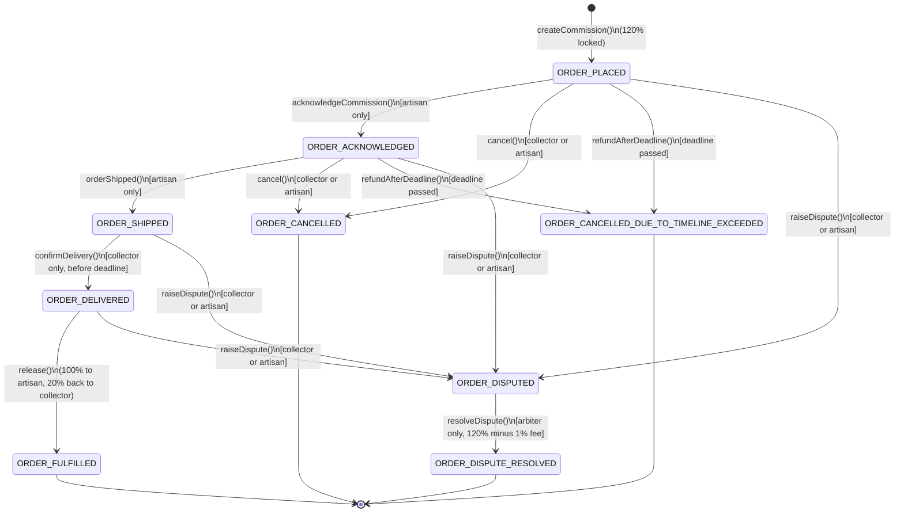

# Commission Escrow

Kalpana paints Warli scenes on cloth in a village three hours from Nashik. A collector in Berlin
wants to commission a piece. Neither wants to trust a middleman with the money: the collector's
payment should be **locked on-chain the moment the deal is struck**, **released to the artisan
only once delivery is confirmed**, **returned automatically to the collector if the deadline
passes with nothing delivered**, and **frozen until a neutral arbiter decides** if the two of them
disagree. And it has to protect both sides symmetrically: the artisan can't fake their own
delivery to grab the money, and the collector can't just go silent forever once the work has
shipped — see [The 20% confirmation deposit](#the-20-confirmation-deposit) below for how that
second problem is solved.

This repo is exactly that, built with [Scaffold-ETH 2](https://scaffoldeth.io) (Foundry + Next.js /
wagmi / viem), targeting Base Sepolia.

```
Collector ──funds (120%)──▶  CommissionEscrow  ──on-time delivery──▶  100% to Artisan, 20% back to Collector
                              (one per deal)    ──refunds on timeout (pre-shipping)──▶  120% to Collector
                                                 ──splits on dispute─────▶  120% (minus 1% fee) to the winner
```

## What's actually in here

- **`CommissionEscrowFactory.sol`** — the entry point. A collector calls `createCommission()`
  here with the agreed price attached as `msg.value`. Internally it deploys a cheap [EIP-1167
  minimal proxy clone](https://eips.ethereum.org/EIPS/eip-1167) of `CommissionEscrow` for that one
  deal (so every commission gets its own contract, without paying full deployment gas each time).
  It also holds the global, OpenZeppelin-`AccessControl`-backed `ARBITER_ROLE` roster, and a public
  list of every commission currently in dispute — the "marketplace" any approved arbiter can pick
  work from.
- **`CommissionEscrow.sol`** — the escrow logic itself, one instance per commission. Handles
  funding, artisan acknowledgment/shipping, collector delivery confirmation (with a refundable
  confirmation deposit — see below), payout, timeout refunds, early cancellation, and dispute
  resolution. Uses OpenZeppelin's `ReentrancyGuard` and the Checks-Effects-Interactions pattern
  throughout, so state is always finalized before any ETH leaves the contract.
- **`packages/foundry/test/`** — 56 Foundry tests covering the full lifecycle (see [Running the
  tests](#running-the-tests) below).
- **`packages/nextjs/`** — the stock Scaffold-ETH 2 frontend. No custom pages were built for this
  challenge; the built-in **Debug Contracts** page is enough to fund, confirm, release, dispute and
  resolve commissions by hand (see [Try it in the browser](#try-it-in-the-browser)). See [Future
  scope](#future-scope) for what a dedicated commission UI would add.

Every contract function has detailed NatSpec comments explaining *what* it does and, more
importantly, *why* — read `CommissionEscrow.sol` top to bottom if you want the full design
rationale (clones vs. constructors, why the reentrancy guard is safe on a proxy, etc).

## Requirements

- [Node.js >= 20.18.3](https://nodejs.org/en/download/)
- [Yarn](https://yarnpkg.com/getting-started/install) (this repo uses Yarn 4, pinned via
  `packageManager` in `package.json` — just having any modern Yarn/Corepack available is enough)
- [Foundry](https://book.getfoundry.sh/getting-started/installation) (`forge`, `anvil`, `cast`)
- [Git](https://git-scm.com/downloads)

## Quickstart (local)

Three terminals, from the repo root:

**1. Install dependencies**

```bash
yarn install
```

**2. Terminal 1 — start a local chain**

```bash
yarn chain
```

Starts an Anvil node on `http://127.0.0.1:8545` (chain id `31337`) and imports a well-known,
public Anvil test account into a local Foundry keystore named `scaffold-eth-default` so contracts
can be deployed without ever putting a real private key in a file. This is Anvil's own default
account #9 — the same key every Anvil user gets — not a project secret.

**3. Terminal 2 — deploy the contracts**

```bash
yarn deploy
```

Runs `packages/foundry/script/DeployCommissionEscrowFactory.s.sol`, which deploys
`CommissionEscrowFactory` (this also deploys the one shared `CommissionEscrow` implementation the
factory clones from). The deployer always gets `DEFAULT_ADMIN_ROLE`; `ARBITER_ROLE` goes to
whatever address is set in the `INITIAL_ARBITER` environment variable, or falls back to the
deployer if that's unset — so there's always at least one working arbiter out of the box, but a
real deployment can hand day-to-day dispute resolution to a separate address (e.g. a multisig)
from the start. The script then auto-generates the TypeScript ABI the frontend needs at
`packages/nextjs/contracts/deployedContracts.ts`.

**4. Terminal 3 — start the frontend**

```bash
yarn start
```

Visit **http://localhost:3000/debug** — the target network is already set to the local Anvil chain
in `packages/nextjs/scaffold.config.ts`, so the factory you just deployed shows up automatically.

## Try it in the browser

The Debug Contracts page (`/debug`) lets you call every function directly, and Scaffold-ETH's
built-in **burner wallet** lets you switch "accounts" instantly to play both sides of a deal —
click the account button (top right) to generate/switch burner wallets, and use the local faucet
button to fund them with test ETH.

A full happy-path walkthrough:

1. **As the collector**, open `CommissionEscrowFactory` → `createCommission`, fill in the
   artisan's address, a future Unix timestamp for `deadline`, attach **120% of the agreed price**
   as the payable value (the extra 20% is the collector's refundable confirmation deposit — see
   [below](#the-20-confirmation-deposit)), and send it. Copy the returned commission address (or
   read it back via `getAllCommissions`).
2. Paste that address into the **"Read/Write custom contract"** section of `/debug` using the
   `CommissionEscrow` ABI (or just add its address under `getCommissionsByArtisan` /
   `getCommissionsByCollector` results) to interact with that specific commission.
3. **As the artisan** (switch burner wallet), call `acknowledgeCommission()` to accept the job,
   then `orderShipped()` once the work is on its way.
4. **As the collector** (switch burner wallet back), call `confirmDelivery()` — **before the
   deadline** — once the work has actually arrived. This is the step that closes the "artisan pays
   themselves" loophole, since only the collector can attest that delivery really happened.
5. Anyone can now call `release()` — the artisan receives the 100% commission price, and the
   collector automatically gets their 20% deposit back in the same transaction.
6. To see the dispute path instead: at any point before release, **as the collector or artisan**,
   call `raiseDispute()`. As the deployer (who holds `ARBITER_ROLE` unless you configured a
   different `INITIAL_ARBITER`), call `resolveDispute(true)` (pay the artisan the full 120%) or
   `resolveDispute(false)` (refund the collector the full 120%) — the resolving address always
   keeps a 1% fee off the top.
7. To see the "collector goes silent" punishment path: after step 3's `orderShipped()`, let the
   `deadline` pass **without** calling `confirmDelivery()` — trying to call it now reverts. As the
   artisan, call `raiseDispute()`, then resolve in the artisan's favor as the arbiter — the artisan
   receives the *entire* 120% (minus the 1% fee), deposit included, as the penalty for the
   collector's silence.
8. To see the plain timeout path instead: let the `deadline` pass while still in `ORDER_PLACED` or
   `ORDER_ACKNOWLEDGED` (i.e. the artisan never shipped), then call `refundAfterDeadline()` — the
   collector gets their full 120% back automatically, no dispute needed, since the failure here is
   the artisan's. This self-serve refund stops working the moment the artisan ships (see the
   `refundAfterDeadline()` NatSpec for why).

## Running the tests

```bash
yarn foundry:test
# or, from packages/foundry:
forge test -vv
```

56 tests across two files, one function per numbered requirement (see comments in the test files
for the exact mapping):

| # | Requirement | Covered in |
|---|---|---|
| 1 | Escrow holds funds before work begins | `CommissionEscrow.t.sol` — `test_EscrowHoldsFundsAtCreation` |
| 2 | Release requires confirmed delivery | `test_RevertWhen_ReleaseCalledBeforeDeliveryConfirmed`, `test_RevertWhen_ArtisanConfirmsOwnDelivery` (the artisan cannot fake their own delivery), `test_RevertWhen_ConfirmDeliveryAfterDeadline` (the collector can't stall forever either), `test_ReleaseSucceedsOnlyAfterCollectorConfirmsDeliveryOnTime` |
| 3 | State updated before external transfer | `test_RevertWhen_MaliciousArtisanReentersOnRelease` (a hostile artisan contract tries to re-enter `release()` from its `receive()` hook) |
| 4 | Timeout produces an explicit refund path | `test_RefundAfterDeadlineReturnsFundsToCollector`, `test_RevertWhen_RefundAttemptedOnDisputedCommissionAfterDeadline` |
| 5 | Disputes aren't resolved by either party alone | `test_RevertWhen_CollectorResolvesOwnDispute`, `test_RevertWhen_ArtisanResolvesOwnDispute`, `test_ApprovedArbiterResolvesDisputeInFavorOfArtisan` |
| 6 | Commission amount comes from value actually sent | `test_AmountIsSetFromActualMsgValueNotACallerArgument` |
| 7 | No double release of the same commission | `test_RevertWhen_ReleaseCalledTwice`, `test_RevertWhen_RefundAfterDeadlineCalledTwice`, `test_RevertWhen_ResolveDisputeCalledTwice` |
| 8 | No credentials in tracked files | see [Security & repo hygiene](#security--repo-hygiene) below |

`CommissionEscrowFactory.t.sol` additionally covers clone deployment gas savings, the `AccessControl`
arbiter roster, and the disputed-commissions "marketplace" list lifecycle.

## The commission lifecycle



Every arrow above corresponds to exactly one function in `CommissionEscrow.sol`. Note `confirmDelivery()`
is deliberately `[collector only]`, not artisan — if the artisan could confirm their own delivery, a
dishonest artisan could call it (and then `release()`) without ever doing the work. `cancel()` is
reachable from `ORDER_PLACED` or `ORDER_ACKNOWLEDGED`, but not once the artisan ships: from
`ORDER_SHIPPED` onward, walking away requires a dispute instead. `refundAfterDeadline()` follows the
same cutoff, for the opposite reason: it's a self-serve, no-questions-asked refund that's only fair
while the *artisan* is the one who hasn't acted yet (never acknowledged/shipped); once they've
shipped, a missed deadline is presumptively the *collector's* fault for not confirming, so from
`ORDER_SHIPPED` onward a missed deadline can only be resolved via `raiseDispute()` - see
[The 20% confirmation deposit](#the-20-confirmation-deposit) for why that matters. The four states at
the bottom (`ORDER_FULFILLED`, `ORDER_CANCELLED`, `ORDER_CANCELLED_DUE_TO_TIMELINE_EXCEEDED`,
`ORDER_DISPUTE_RESOLVED`) are terminal — every payout function checks the commission's current status
before moving funds and flips it to a terminal value *before* sending any ETH, so calling a payout
function twice on the same commission always reverts the second time.

### The 20% confirmation deposit

`confirmDelivery()` has to be collector-only (see above) - but that raises an obvious follow-up:
what stops the collector from simply *never* confirming, leaving the artisan's completed work
stuck in escrow forever? The answer is a refundable deposit, not a trust assumption:

- The collector locks **120% of the agreed price** at `createCommission()` - 100% is the true
  commission price, 20% is a good-faith confirmation deposit. `commissionPrice()` and
  `collectorDeposit()` compute this split on demand from the total locked `amount` (never from a
  separately-trusted number).
- Confirm on time (before `deadline`, while `ORDER_SHIPPED`) and `release()` pays the artisan the
  100% price *and* refunds the collector's 20% deposit in the same transaction - acting honestly
  and promptly costs the collector nothing.
- Let the deadline pass while `ORDER_SHIPPED` without confirming, and `confirmDelivery()` becomes
  permanently blocked (`DeadlineAlreadyPassed`). The artisan's only recourse from there is
  `raiseDispute()`.
- `resolveDispute()` needs no special "forfeit the deposit" logic to punish that silence: it always
  splits the *entire* locked 120% (minus the 1% arbiter fee) between the arbiter and whichever
  party wins. So when an arbiter sides with an artisan who was stonewalled, the artisan
  automatically receives the collector's deposit too - not just the price they were owed.
- Before the artisan ships, none of this applies: `cancel()` and `refundAfterDeadline()` both
  refund the collector's full 120%, since nothing has gone wrong on the collector's side yet.

### Roles

| Role | Who | Can do |
|---|---|---|
| Collector | Whoever called `createCommission()` | `confirmDelivery()`, `cancel()`, `raiseDispute()` |
| Artisan | The address named in `createCommission()` | `acknowledgeCommission()`, `orderShipped()`, `cancel()`, `raiseDispute()` |
| Arbiter | Any address the factory admin has granted `ARBITER_ROLE` (via `grantRole`) | `resolveDispute()` on **any** disputed commission from **any** collector/artisan pair — this shared roster plus the 1% fee is the "marketplace" that keeps disputes from sitting open forever |
| Anyone | — | `release()`, `refundAfterDeadline()` — deliberately unrestricted, since there's nothing to gain by gatekeeping who *triggers* a payout that's already fully determined by on-chain state |

`cancel()` can be called by either the collector or the artisan, but only while the commission is
still `ORDER_PLACED` or `ORDER_ACKNOWLEDGED` — the moment the artisan ships, `cancel()` becomes
unreachable for both parties and a dispute is the only way to unwind the deal.

## Deploying to Base Sepolia

1. Generate or import a deployer keystore (never store a raw private key in `.env`):
   ```bash
   cd packages/foundry
   yarn account:generate   # or: yarn account:import
   ```
2. Fund that address with Base Sepolia ETH from a faucet.
3. Add your own `ALCHEMY_API_KEY` (and optionally `ETHERSCAN_API_KEY` for verification) to
   `packages/foundry/.env` — copy `.env.example` first if you haven't. Optionally also set
   `INITIAL_ARBITER` to a different address (e.g. a multisig) if you don't want the deployer itself
   holding `ARBITER_ROLE` — it defaults to the deployer if left unset.
4. Deploy:
   ```bash
   yarn deploy --network baseSepolia
   ```
5. Point the frontend at it: add `chains.baseSepolia` to `targetNetworks` in
   `packages/nextjs/scaffold.config.ts`.

## Security & repo hygiene

- **Reentrancy**: `release()`, `cancel()`, `refundAfterDeadline()` and `resolveDispute()` are all
  `nonReentrant` *and* follow Checks-Effects-Interactions — `status` is flipped to its terminal
  value before any ETH transfer. See `test_RevertWhen_MaliciousArtisanReentersOnRelease`.
- **Clone safety**: the shared `CommissionEscrow` implementation calls `_disableInitializers()` in
  its constructor, so it can never itself be initialized as a fake commission — only real clones
  created by the factory can be. See `test_RevertWhen_ImplementationInitializedDirectly`.
- **No trusted "amount" input**: a commission's `amount` is always read from `msg.value` at
  funding time, never from a separate argument a caller could set independently.
- **No credentials committed**: `packages/foundry/.env` is git-ignored; the `ALCHEMY_API_KEY` /
  `ETHERSCAN_API_KEY` values in the tracked `.env.example` are Scaffold-ETH 2's own public shared
  demo keys (present in every Scaffold-ETH 2 project), not project secrets. The private key in
  `packages/foundry/Makefile` is Anvil's well-known, publicly documented local test account #9 —
  it only ever exists on your local Anvil chain and holds no real value; it is required by
  Scaffold-ETH 2's standard local-dev workflow so that no *real* private key ever needs to touch a
  file. No other keys, credentials, or authenticated URLs appear anywhere in this repo.

## Future scope

This challenge intentionally scoped the deliverable to the contracts, their tests, and this
README, using Scaffold-ETH 2's stock Debug Contracts page as the UI. Left for later:

- A dedicated commission UI: a "create a commission" form, a per-role dashboard (collector /
  artisan / arbiter) instead of raw ABI calls, live status/countdown badges, and a browsable list
  of the disputed-commissions "marketplace" for arbiters.
- Wiring `confirmDelivery()` to a real off-chain oracle/keeper that watches a carrier's AWB
  (air waybill) tracking status, instead of a direct collector-triggered call.
- **N-of-M / multisig-style arbiter voting.** `resolveDispute()` currently trusts a single
  `ARBITER_ROLE` holder's verdict — nothing on-chain can stop a colluding arbiter from lying (see
  the `@dev` block on `resolveDispute()` for the full reasoning on why the verdict has to be a
  function parameter in the first place). Requiring several independent arbiters to agree before
  funds move would raise the cost of collusion considerably and is the natural next step here.
- Hardening: a formal audit / Slither static-analysis pass, fuzz and invariant tests (Foundry
  supports both) on top of the current unit tests, an upgrade path for the arbiter fee percentage,
  and event indexing (a subgraph or similar) so front-ends aren't limited to on-chain reads.
- Support for ERC-20 payment as well as native ETH.
